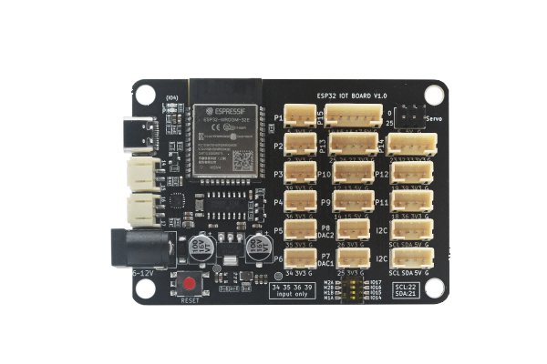
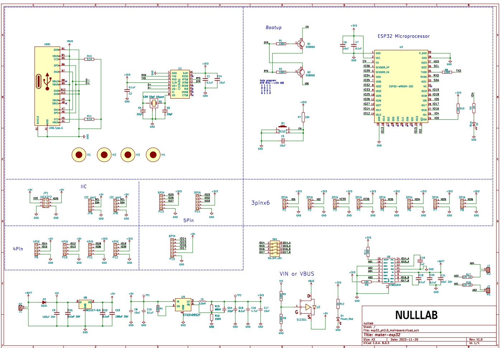

# ESP32-IOT-Board

Product Image
-------------



## Introduction

The ESP32 IOT Board is a high-performance controller developed by NULLLAB, based on the Espressif ESP32-WROOM-32E module.It is specifically engineered for Maker education, STEAM projects.This motherboard is equipped with two AT8833 motor driver chips, with a maximum current of 1.2A. It supports DC head power supply, and all available pins are derived from all PH2.0 interfaces, which is convenient for external sensors and application scenarios.

Technical Specifications
------------------------

| Feature           | Details                                                                                                 |
| ----------------- | ------------------------------------------------------------------------------------------------------- |
| Core Module       | ESP32-WROOM-32E (Integrated 2.4 GHz Wi-Fi & Dual-mode Bluetooth)                                        |
| Memory            | 448KB ROM, 520KB SRAM, 4MB Flash                                                                        |
| Input Voltage     | DC 6V – 16V (Standard 5.5-2.1mm DC Jack)                                                                |
| Motor Driver Chip | AT8833                                                                                                  |
| Max Current       | Up to 1.2A (Single Motor)                                                                               |
| Dimensions        | 80mm × 56mm (PCB Thickness: 1.6mm)                                                                      |
| Weight            | 25.3g (Net)                                                                                             |
| Mounting          | M4 Holes, LEGO Compatible                                                                               |
| BLUE LED          | GPIO4                                                                                                   |
| Motor Pin         | M1(14, 15) M2(16, 17)                                                                                   |
| Servo Pin         | 0, 25                                                                                                   |
| Pin Instruction   | 3PIN PH2.0 Interface * 8, 4PIN PH2.0 Interface * 5,  5PIN PH2.0 Interface * 2, 6PIN PH2.0 Interface * 1 |

Driver Installation
-------------------

[CH341SER.ZIP - Nanjing Qinheng Microelectronics Co., Ltd.](https://www.wch-ic.com/downloads/CH341SER_ZIP.html)

### Schematic diagra



[Click here to view the schematic](./esp32_ph2.0_mainboard.pdf)

## Pin Instructions

| Description    | Expansion board port | Corresponding ports         | Description    | Expansion board port | Corresponding ports     |
|:--------------:|:--------------------:|:---------------------------:|:--------------:|:--------------------:|:-----------------------:|
| 3PIN Interface | P1                   | GPIO5                       | 3PIN Interface | P2                   | GPIO2                   |
| 3PIN Interface | P3                   | GPIO39                      | 3PIN Interface | P4                   | GPIO36                  |
| 3PIN Interface | P5                   | GPIO35                      | 3PIN Interface | P6                   | GPIO34                  |
| 3PIN Interface | P7                   | GPIO25                      | 3PIN Interface | P8                   | GPIO26                  |
| 4PIN Interface | P9                   | GPIO14、GPIO15               | 4PIN Interface | P10                  | GPIO12、GPIO13           |
| 4PIN Interface | P11                  | GPIO18、GPIO36               | 4PIN Interface | P12                  | GPIO19、GPIO39           |
| 4PIN Interface | I2C                  | GPIO22(SCL)、GPIO21(SDA)     | 4PIN Interface | I2C                  | GPIO22(SCL)、GPIO21(SDA) |
| 5PIN Interface | P13                  | GPIO25、GPIO26、GPIO27        | 5PIN Interface | P14                  | GPIO23、GPIO32、GPIO33    |
| 6PIN Interface | P15                  | GPIO14、GPIO15、GPIO16、GPIO17 |                |                      |                         |

## Examples

1. Open Arduino IDE ---> Tools ---> Board ---> esp32 ---> ESP32-WROOM-DA Module

2. Select port , Arduino IDE ---> Tools ---> Port

3. Download the following program to the motherboard

```c
/*
  Blink

  Turns an LED on for one second, then off for one second, repeatedly.

  Most Arduinos have an on-board LED you can control. On the UNO, MEGA and ZERO
  it is attached to digital pin 13, on MKR1000 on pin 6. LED_BUILTIN is set to
  the correct LED pin independent of which board is used.
  If you want to know what pin the on-board LED is connected to on your Arduino
  model, check the Technical Specs of your board at:
  https://www.arduino.cc/en/Main/Products

  modified 8 May 2014
  by Scott Fitzgerald
  modified 2 Sep 2016
  by Arturo Guadalupi
  modified 8 Sep 2016
  by Colby Newman

  This example code is in the public domain.

  https://www.arduino.cc/en/Tutorial/BuiltInExamples/Blink
*/

// the setup function runs once when you press reset or power the board
void setup() {
  // initialize digital pin GPIO 4 as an output.
  pinMode(4, OUTPUT);
}

// the loop function runs over and over again forever
void loop() {
  digitalWrite(4, HIGH);  // turn the LED on (HIGH is the voltage level)
  delay(1000);            // wait for a second
  digitalWrite(4, LOW);   // turn the LED off by making the voltage LOW
  delay(1000);            // wait for a second
}


```

Upload success phenomenon:   The L light in the upper left corner of the motherboard flashes blue every second.

Advanced Features & Critical Notes
----------------------------------

### Motor and IO Switch (Multi-purpose Selector)

The board features a specialized DIP switch to toggle the function of the M1 and M2 ports

1. IO Position: The M1 and M2 motor ports are disabled. The associated pins act as standard General Purpose Input/Output (GPIO) ports for sensors.
2. Motor Position (M1A/M1B/M2A/M2B): Enables full motor driving capability for the M1 and M2 ports.

### Input/Output Restrictions (Hardware Constraints)

Due to the native architecture of the ESP32 chip, users must be aware of the following when using the Arduino framework

1. Input Only: Pins 34, 35, 36, and 39 can only be used as inputs. They cannot be configured as outputs.
2. No Internal Resistors: These specific pins (34, 35, 36, 39) do not support internal pull-up or pull-down modes. If using these for buttons or digital signals, external resistors are required.

Software & Programming
----------------------

Maker-ESP32 is cross-platform compatible, making it suitable for both beginners and advanced developers

* Arduino IDE: Use the ESP32 board manager to upload C++ code.
* MicroPython/Python: Ideal for rapid prototyping and AI-based logic.

**Reference Links**
-------------------

[esp32_datasheet_en.pdf](https://documentation.espressif.com/esp32_datasheet_en.pdf)

[ESP-IDF Programming Guide](https://docs.espressif.com/projects/esp-idf/en/latest/esp32/get-started/index.html)

[ESP-IDF Extension for VSCode - - — ESP-IDF Extension for VSCode latest documentation](https://docs.espressif.com/projects/vscode-esp-idf-extension/en/latest/index.html)

[MicroPython language and implementation — MicroPython latest documentation](https://docs.micropython.org/en/latest/reference/index.html)

[micropython/ports/esp32/README.md at master · micropython/micropython](https://github.com/micropython/micropython/blob/master/ports/esp32/README.md)

[Welcome to ESP32 Arduino Core’s documentation - - — Arduino ESP32 latest documentation](https://docs.espressif.com/projects/arduino-esp32/en/latest/index.html)
